---
## Author
author:
  name: Швецов Михаил Романович
  degrees: DSc
  orcid: 0000-0002-0877-7063
  email: 1132236100@rudn.ru
  affiliation:
    - name: Российский университет дружбы народов
      country: Российская Федерация
      postal-code: 117198
      city: Москва
      address: ул. Миклухо-Маклая, д. 6

## Title
title: "Отчёт по лабораторной работе"
subtitle: "Лабораторная работа №1"
license: "CC BY"
---

# Цель работы

Здесь приводится формулировка цели лабораторной работы.
Формулировки цели для каждой лабораторной работы приведены в методических указаниях.

Цель данного шаблона --- максимально упростить подготовку отчётов по лабораторным работам.
Модифицируя данный шаблон, студенты смогут без труда подготовить отчёт по лабораторным работам, а также познакомиться с основными возможностями разметки Markdown.

# Задание

Здесь приводится описание задания в соответствии с рекомендациями методического пособия и выданным вариантом.

# Теоретическое введение

Здесь описываются теоретические аспекты, связанные с выполнением работы.

Например, в [табл. @tbl-std-dir] приведено краткое описание стандартных каталогов Unix.

| Имя каталога | Описание каталога                                                                                                          |
|--------------|----------------------------------------------------------------------------------------------------------------------------|
| `/`          | Корневая директория, содержащая всю файловую                                                                               |
| `/bin `      | Основные системные утилиты, необходимые как в однопользовательском режиме, так и при обычной работе всем пользователям     |
| `/etc`       | Общесистемные конфигурационные файлы и файлы конфигурации установленных программ                                           |
| `/home`      | Содержит домашние директории пользователей, которые, в свою очередь, содержат персональные настройки и данные пользователя |
| `/media`     | Точки монтирования для сменных носителей                                                                                   |
| `/root`      | Домашняя директория пользователя  `root`                                                                                   |
| `/tmp`       | Временные файлы                                                                                                            |
| `/usr`       | Вторичная иерархия для данных пользователя                                                                                 |

: Описание некоторых каталогов файловой системы GNU Linux {#tbl-std-dir}

Более подробно про Unix см. в [@tanenbaum_book_modern-os_ru; @robbins_book_bash_en; @zarrelli_book_mastering-bash_en; @newham_book_learning-bash_en].

# Выполнение лабораторной работы

Ранее мы установили все необходимые пакеты и сервисы для лабораторной работы.

Устанвока git flow ([рис. @fig-001]).

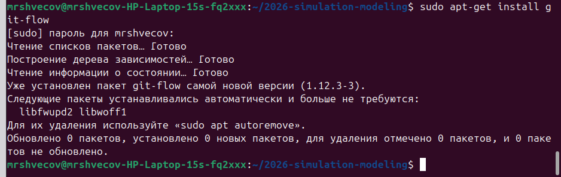{#fig-001 width=70%}

Далее мы мотрим доступные цели make ([рис. @fig-002]).

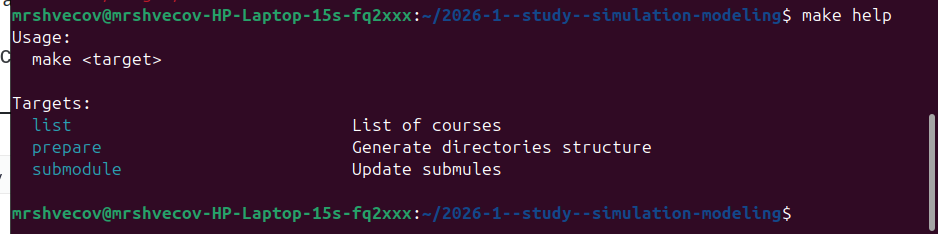{#fig-002 width=70%}

Далее мы мотрим доступные курсы ([рис. @fig-003]).

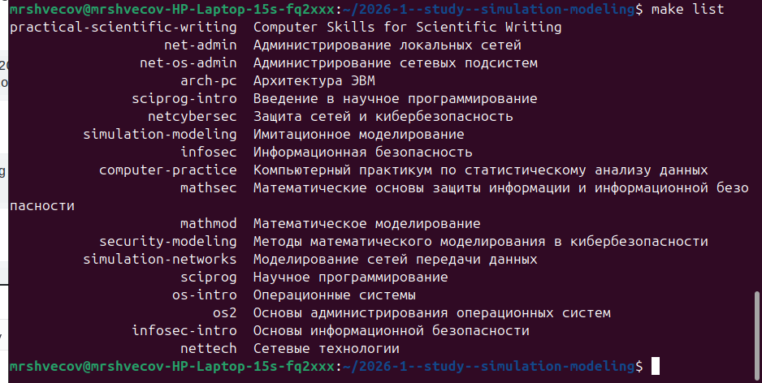{#fig-003 width=70%}

Далее мы переходим в курс и инициализируем курс, отправляем файлы на сервер ([рис. @fig-004]).

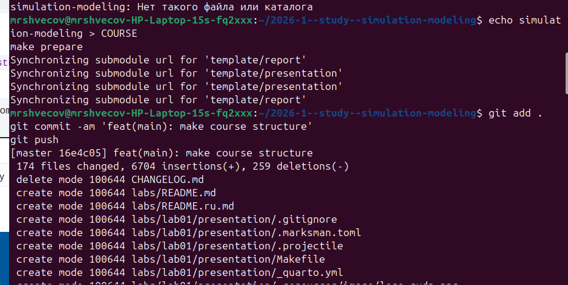{#fig-004 width=70%}

Далее мы инициализируем git flow проверяем, что мы на ветке develop и загружаем весь репозиторий в хранилище ([рис. @fig-005]).

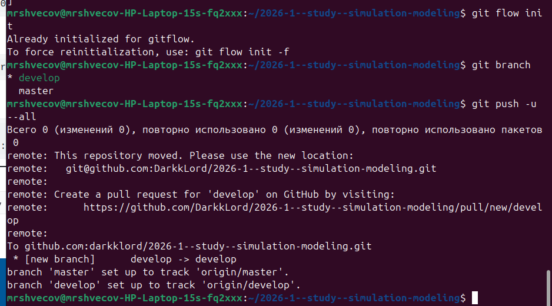{#fig-005 width=70%}

Создадим релиз с версией 1.0.0. Создадим журнал изменений. Добавим журнал изменений в индекс. Зальём релизную ветку в основную ветку. Отправим данные на github ([рис. @fig-006]).

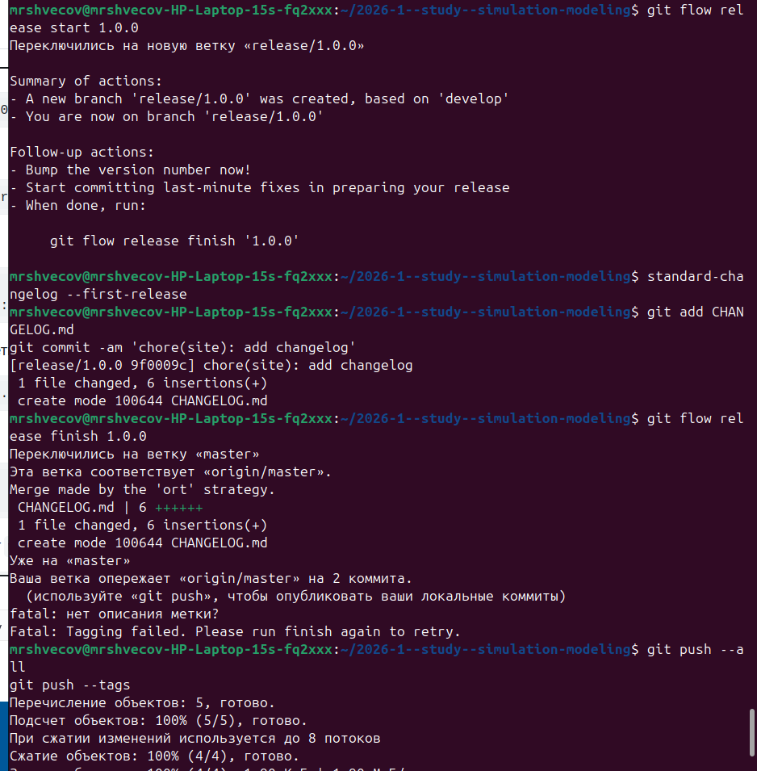{#fig-006 width=70%}

Скопируем CHANGELOG.md в каталог release ([рис. @fig-007]).

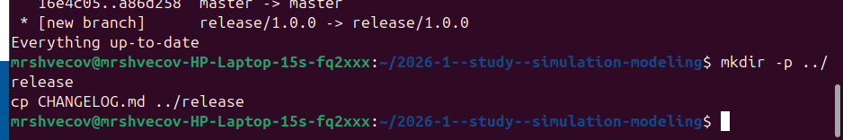{#fig-007 width=70%}

Создадим релиз ([рис. @fig-008]).

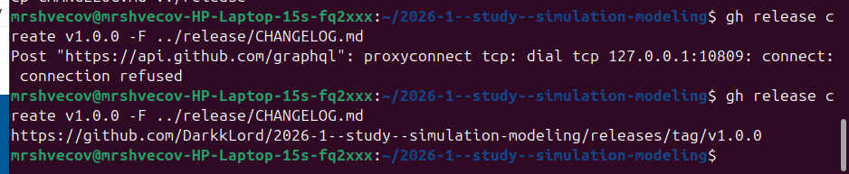{#fig-008 width=70%}

Перейдём в каталог лабораторной, откроем julia и выполним код на рисунке ([рис. @fig-009]).

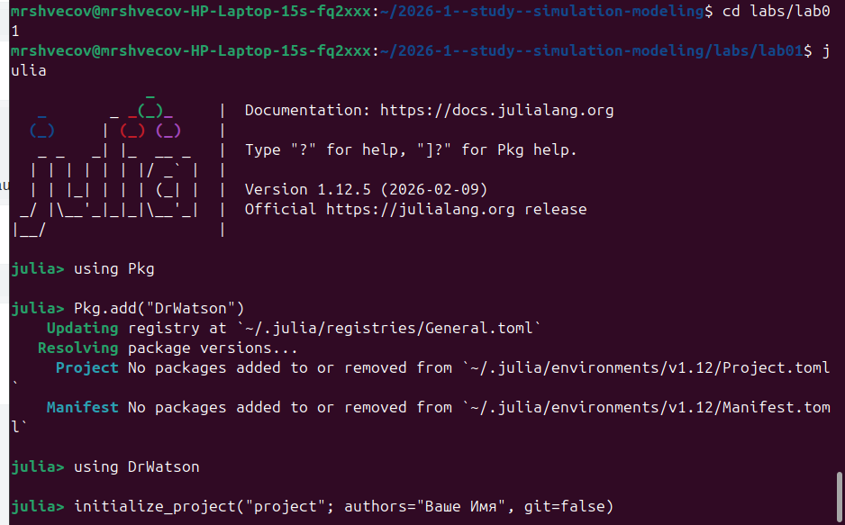{#fig-009 width=70%}

Переходим в созданый каталог ([рис. @fig-0010]).

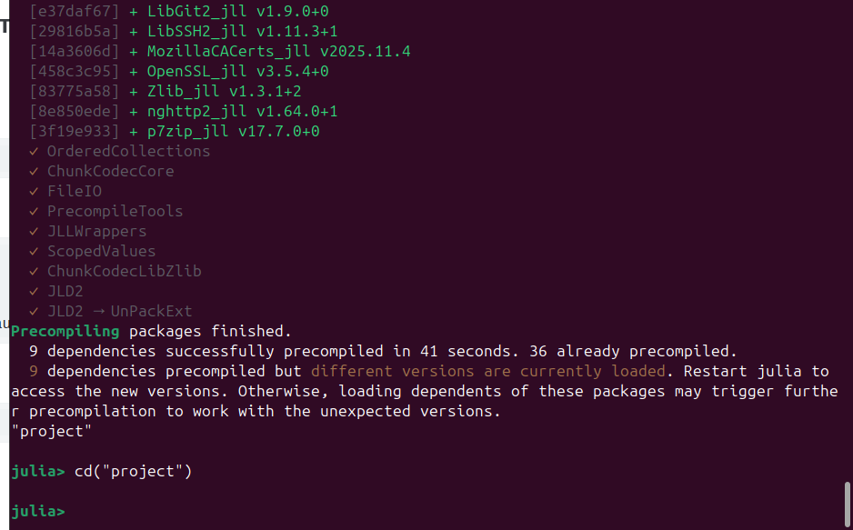{#fig-0010 width=70%}

Добавление необходимых пакетов ([рис. @fig-0011]).

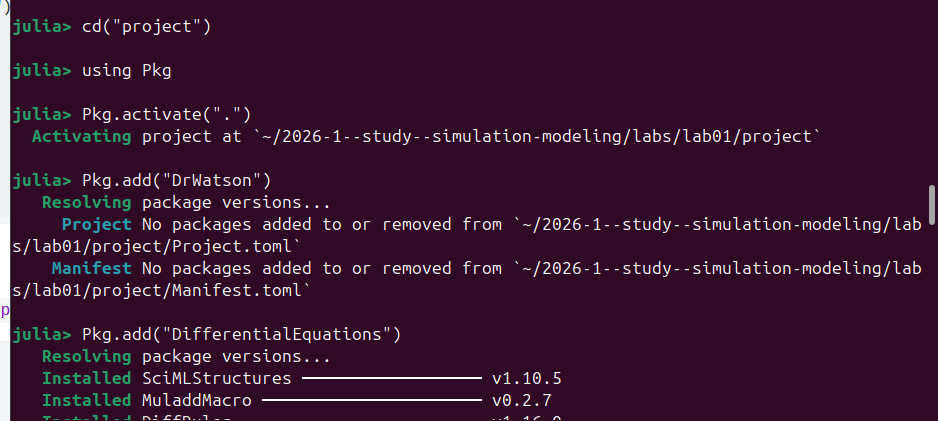{#fig-0011 width=70%}

Проверка установленых пакетов ([рис. @fig-0012]).

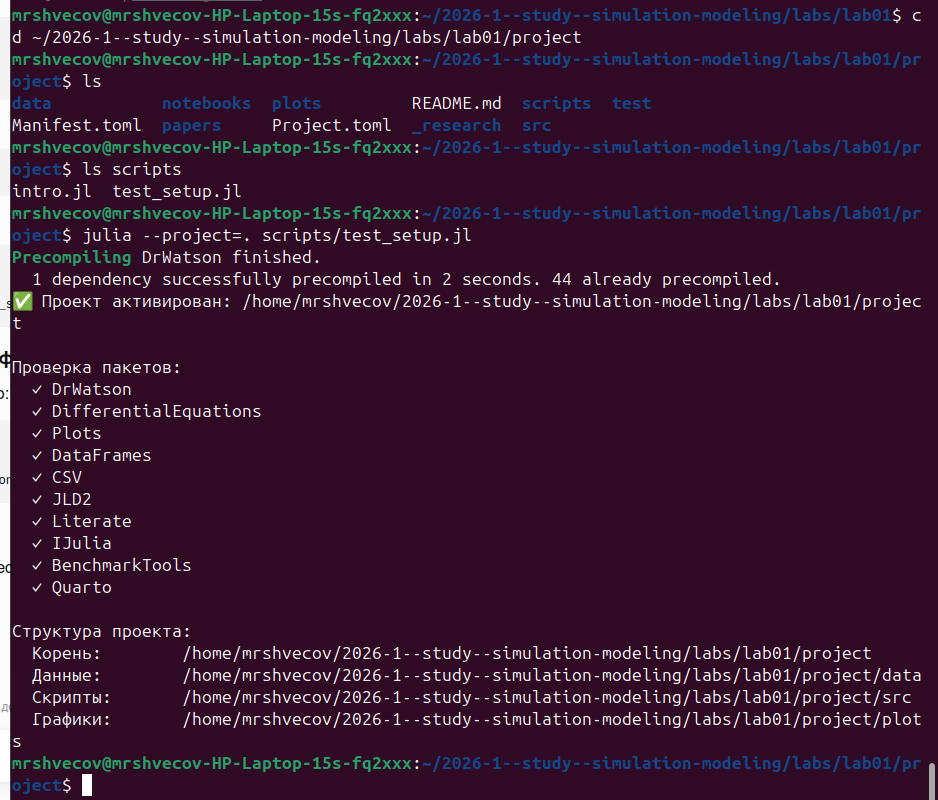{#fig-0012 width=70%}

Реализация модели экспоненциального роста ([рис. @fig-0013]).

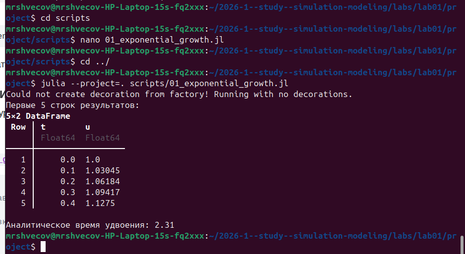{#fig-0013 width=70%}

Просмотр получившегося графика в каталоге /plots ([рис. @fig-0014]).

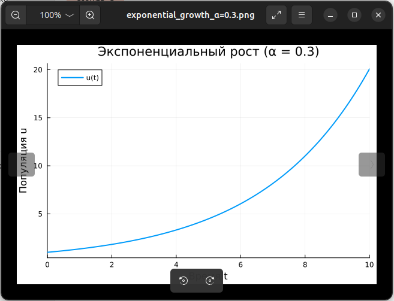{#fig-0014 width=70%}

Изменяем файл scripts/01_exponential_growth.lj и запускем его ([рис. @fig-0015]).

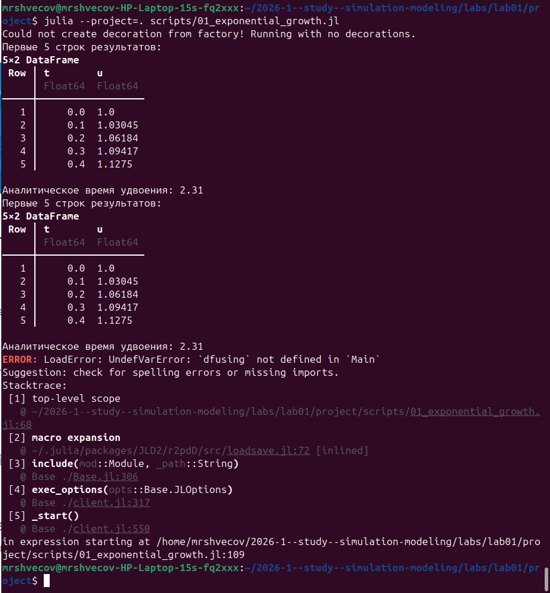{#fig-0015 width=70%}

Создадим скрипт для генерации производных форматов (scripts/tangle.jl) ([рис. @fig-0016]).

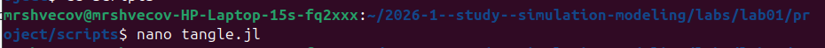{#fig-0016 width=70%}

Выполнение программы ulia --project=. scripts/02_exponential_growth.jl ([рис. @fig-0017]).

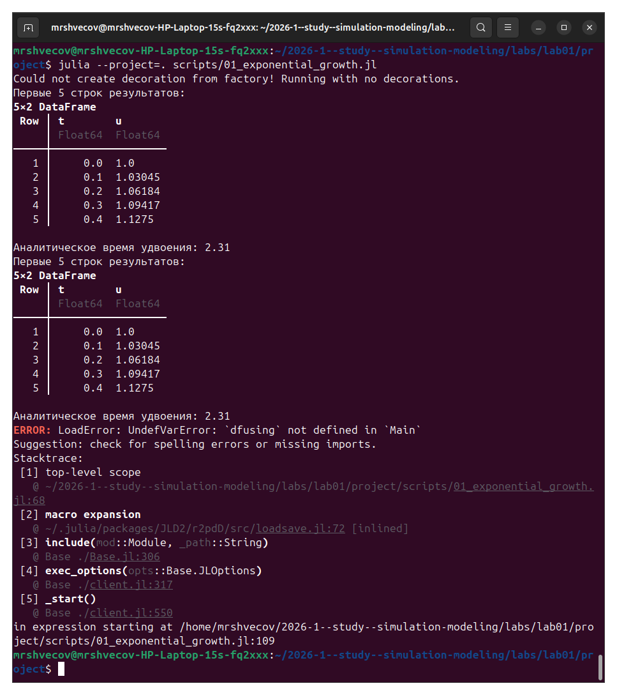{#fig-0017 width=70%}

Создадим производные форматы (scripts/tangle.jl) ([рис. @fig-0018]).

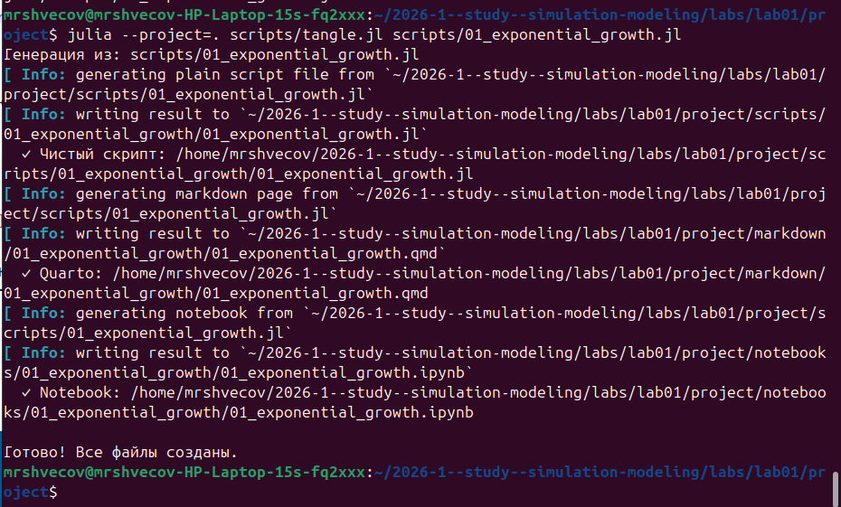{#fig-0018 width=70%}

Выполняем Jupyter-ноутбук notebooks/01_exponential_growth/01_exponential_growth.ipynb ([рис. @fig-0019]).

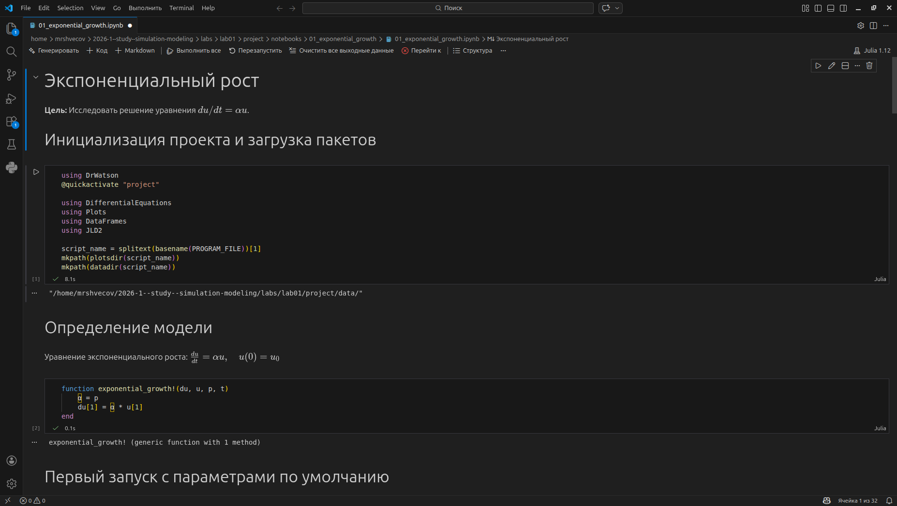{#fig-0019 width=70%}

В каталоге отчёта в файл _quarto.yml включаем поддержку кода julia. ([рис. @fig-0020]).

{#fig-0020 width=70%}

В преамбуле preamble.tex подключаем пакет juliamono ([рис. @fig-0021]).

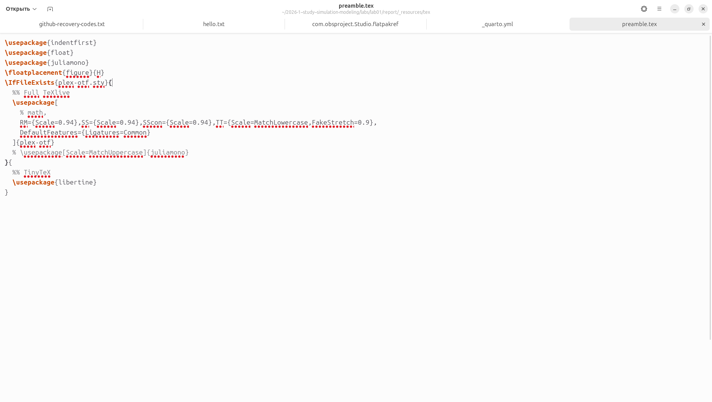{#fig-0021 width=70%}

Перенесём программу в файл scripts/02_exponential_growth.lj и выполним программу ([рис. @fig-0022]).

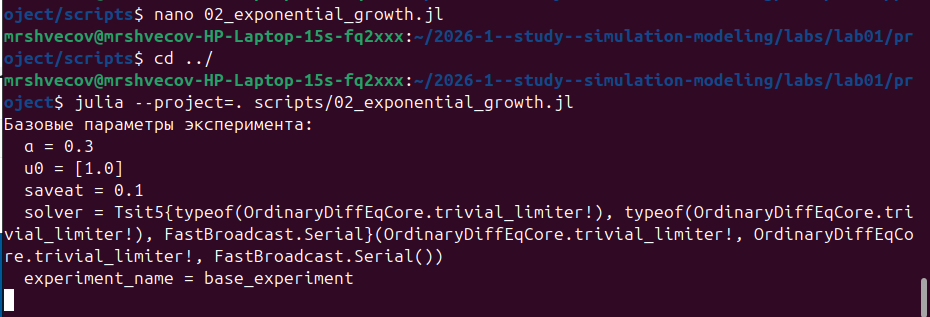{#fig-0022 width=70%}

Создадим производные форматы ([рис. @fig-0023]).

{#fig-0023 width=70%}

Выполните Jupyter-ноутбук notebooks/02_exponential_growth/02_exponential_growth.ipynb ([рис. @fig-0024]).

{#fig-0024 width=70%}


# Выводы

В данной лабораторной работе мы подключили github и gitverse, установили необходимые пакеты, выполнели несколько программ, литератузировали код и создали несколько документов Jupyter-notebooks.

# Список литературы{.unnumbered}

::: {#refs}
:::
