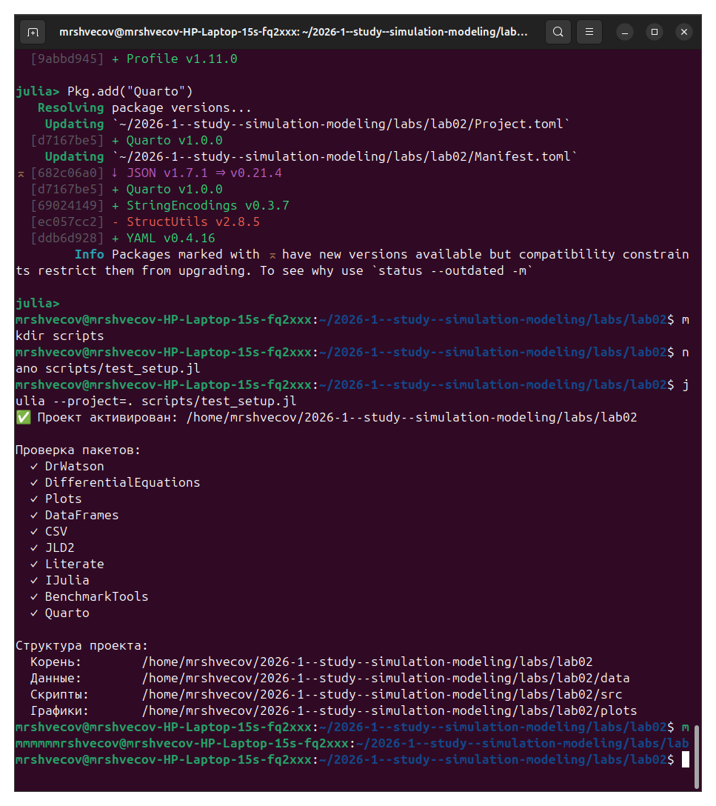
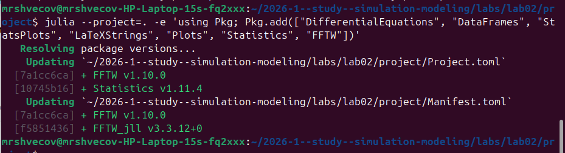
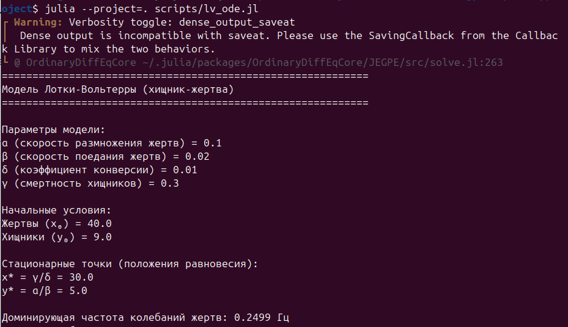
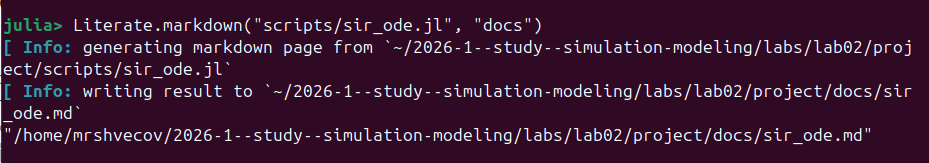
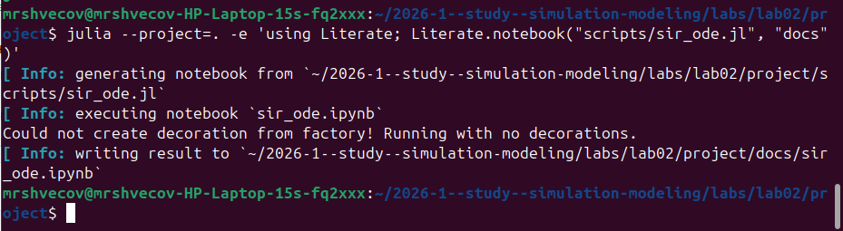
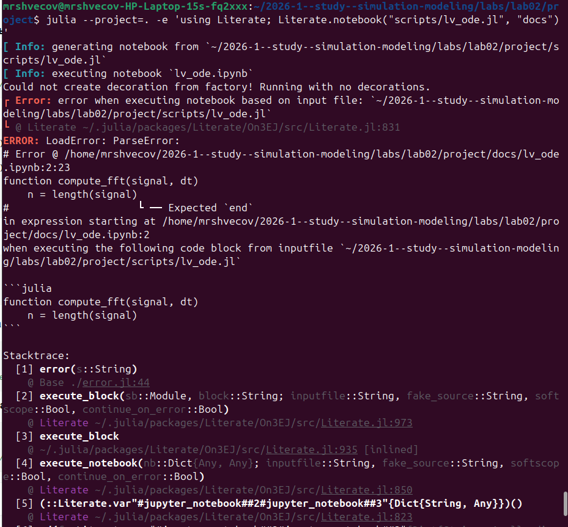
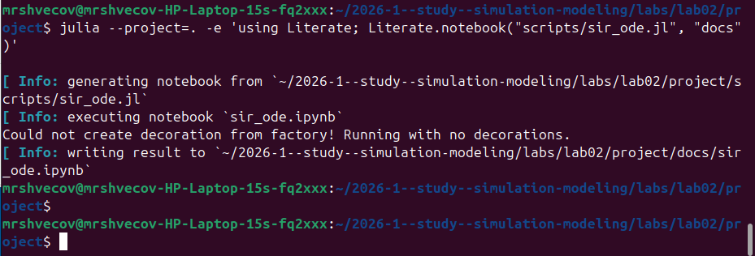
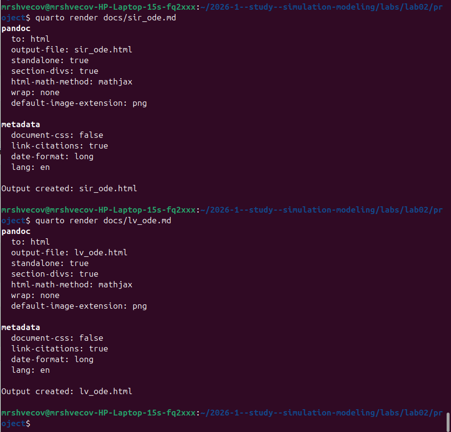
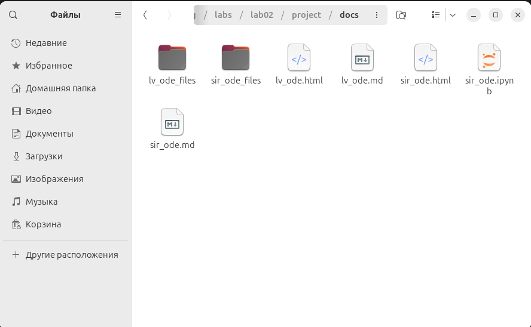

---
## Author
author:
  name: Швецов Михаил Романович 
  degrees: DSc
  orcid: 0000-0002-0877-7063
  email: 1132236100@rudn.ru
  affiliation:
    - name: Российский университет дружбы народов
      country: Российская Федерация
      postal-code: 117198
      city: Москва
      address: ул. Миклухо-Маклая, д. 6
## Title
title: Презентация лабораторной работы
subtitle: Лабораторная работа №2
license: CC BY
date: today
date-format: "2026-09-02" # Example: 2025-09-06
---

# Информация

---

## Докладчик

::: {.columns}

::: {.column width="70%"}

- **Швецов Михаил Романович**
- студент кафедры теории вероятностей и кибербезопасности
- Российский университет дружбы народов им. П. Лумумбы
- [1132236100@rudn.ru](mailto:1132236100@rudn.ru)
- <https://DarkkLord.github.io/ru/>

:::

::: {.column width="30%"}

:::

:::

--- 

# Выполнение лабораторной работы

---

Создаём рабочий каталог и активируем проект ([рис. @fig-001]).

{#fig-001 width=70%}

---

Далее устанавливаем необходимые пакеты ([рис. @fig-002]).

{#fig-002 width=70%}

---

Далее проверяем правильность установки ([рис. @fig-003]).

{#fig-003 width=70%}

---

Далее мы смотрим какие пакеты нужно доустановить для наших скриптов и устанавливаем их ([рис. @fig-004]).

{#fig-004 width=70%}

---

Установка дополнительного пакета для второго скрипта ([рис. @fig-005]).

{#fig-005 width=70%}

---

Создадим и запустим первый скрипт ([рис. @fig-006]).

{#fig-006 width=70%}

---

Создаём и запускаем второй скрипт ([рис. @fig-007]).

{#fig-007 width=70%}

---

Загружаем пакет Literate ([рис. @fig-008]).

{#fig-008 width=70%}

---

Создадим литературный стиль маркдаун для первого скрипта ([рис. @fig-009]).

{#fig-009 width=70%}

---

Создадим литературный стиль notebooks для первого скрипта ([рис. @fig-0010]).

{#fig-0010 width=70%}

---

Создадим литературный стиль маркдаун для второго скрипта ([рис. @fig-0011]).

{#fig-0011 width=70%}

---

Создадим литературный стиль notebooks для второго скрипта ([рис. @fig-0012]).

{#fig-0012 width=70%}

---

Удостоверимся, что notebooks был создан ([рис. @fig-0013]).

{#fig-0013 width=70%}

---

Далее мы добавили в код в литературном стиле вычисление для набора параметров и снова создаём литературный стиль маркдаун([рис. @fig-0014]).

{#fig-0014 width=70%}

---

Создадим notebooks для скрипта с набором параметров ([рис. @fig-0015]).

{#fig-0015 width=70%}

---

Создаём документацию в _quarto для обоих скриптов ([рис. @fig-0016]).

{#fig-0016 width=70%}

---

Удостоверимся, что документы созданы ([рис. @fig-0017]).

{#fig-0017 width=70%}

---

# Выводы

--- 

В данной лабораторной работе мы создали два скрипта, преобразовали их в литературный стиль, добавили набор параметров и создали документацию в формате _quarto.

---
