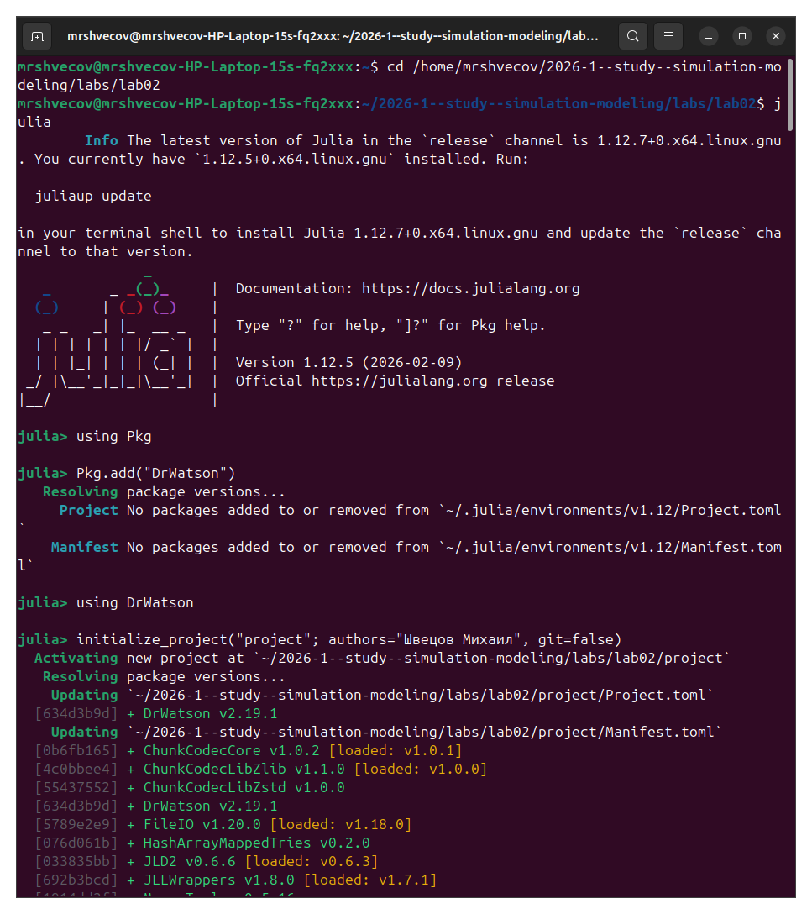
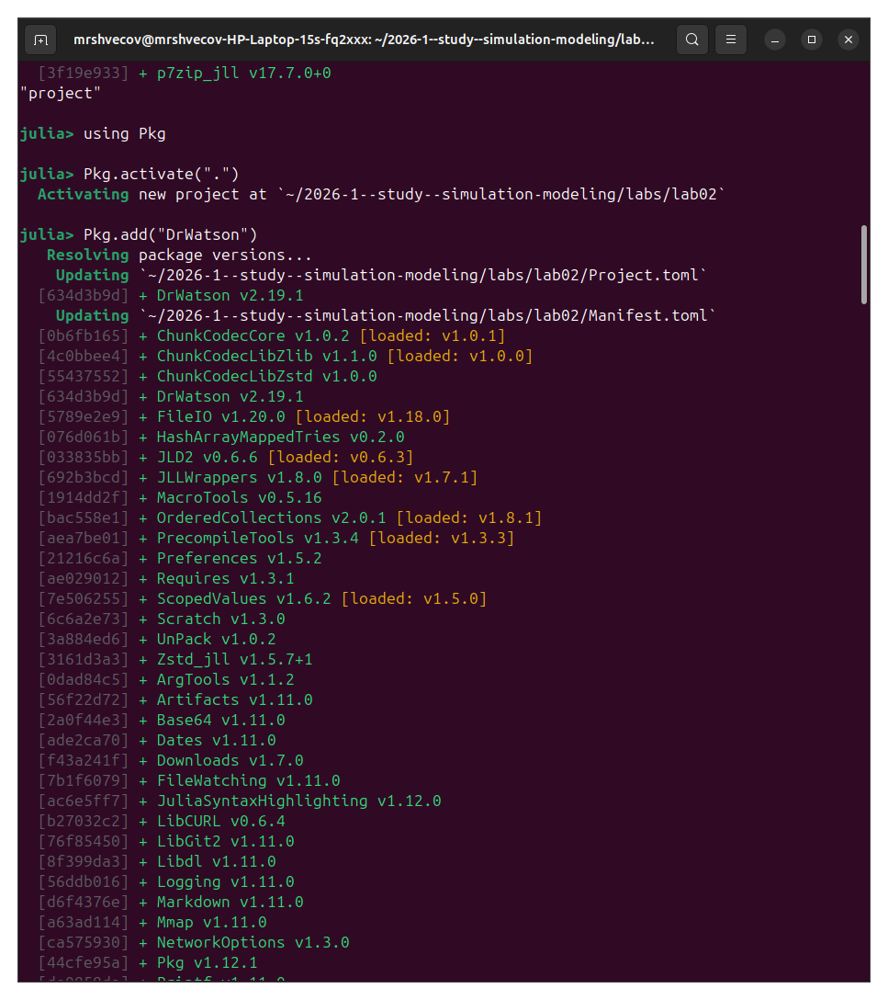
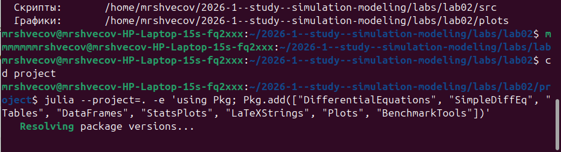
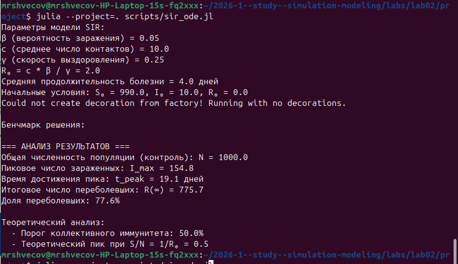
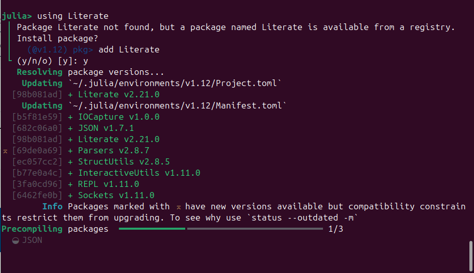
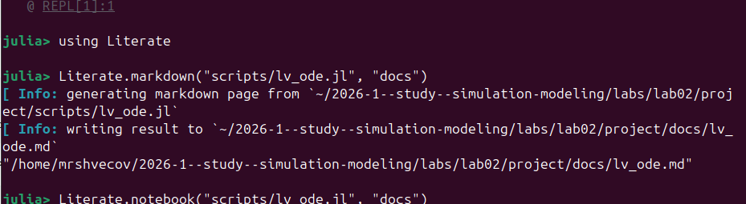
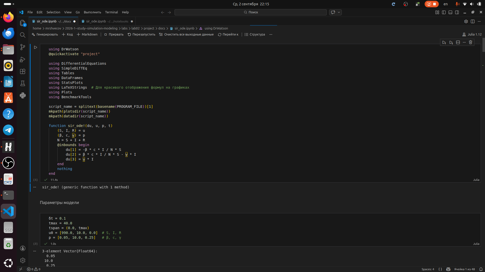
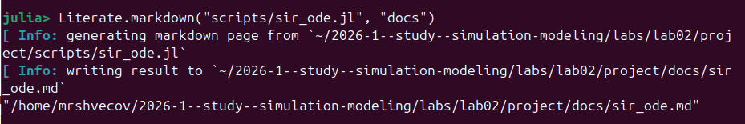

---
## Author
author:
  name: Швецов Михаил Романович
  degrees: DSc
  orcid: 0000-0002-0877-7063
  email: 1132236100@rudn.ru
  affiliation:
    - name: Российский университет дружбы народов
      country: Российская Федерация
      postal-code: 117198
      city: Москва
      address: ул. Миклухо-Маклая, д. 6

## Title
title: "Отчёт по лабораторной работе"
subtitle: "Лабораторная работа №2"
license: "CC BY"
---

# Цель работы

Здесь приводится формулировка цели лабораторной работы.
Формулировки цели для каждой лабораторной работы приведены в методических указаниях.

Цель данного шаблона --- максимально упростить подготовку отчётов по лабораторным работам.
Модифицируя данный шаблон, студенты смогут без труда подготовить отчёт по лабораторным работам, а также познакомиться с основными возможностями разметки Markdown.

# Задание

Здесь приводится описание задания в соответствии с рекомендациями методического пособия и выданным вариантом.

# Теоретическое введение

Здесь описываются теоретические аспекты, связанные с выполнением работы.

Например, в [табл. @tbl-std-dir] приведено краткое описание стандартных каталогов Unix.

| Имя каталога | Описание каталога                                                                                                          |
|--------------|----------------------------------------------------------------------------------------------------------------------------|
| `/`          | Корневая директория, содержащая всю файловую                                                                               |
| `/bin `      | Основные системные утилиты, необходимые как в однопользовательском режиме, так и при обычной работе всем пользователям     |
| `/etc`       | Общесистемные конфигурационные файлы и файлы конфигурации установленных программ                                           |
| `/home`      | Содержит домашние директории пользователей, которые, в свою очередь, содержат персональные настройки и данные пользователя |
| `/media`     | Точки монтирования для сменных носителей                                                                                   |
| `/root`      | Домашняя директория пользователя  `root`                                                                                   |
| `/tmp`       | Временные файлы                                                                                                            |
| `/usr`       | Вторичная иерархия для данных пользователя                                                                                 |

: Описание некоторых каталогов файловой системы GNU Linux {#tbl-std-dir}

Более подробно про Unix см. в [@tanenbaum_book_modern-os_ru; @robbins_book_bash_en; @zarrelli_book_mastering-bash_en; @newham_book_learning-bash_en].

# Выполнение лабораторной работы

Создаём рабочий каталог и активируем проект ([рис. @fig-001]).

{#fig-001 width=70%}

Далее устанавливаем необходимые пакеты ([рис. @fig-002]).

{#fig-002 width=70%}

Далее проверяем правильность установки ([рис. @fig-003]).

{#fig-003 width=70%}

Далее мы смотрим какие пакеты нужно доустановить для наших скриптов и устанавливаем их ([рис. @fig-004]).

{#fig-004 width=70%}

Установка дополнительного пакета для второго скрипта ([рис. @fig-005]).

{#fig-005 width=70%}

Создадим и запустим первый скрипт ([рис. @fig-006]).

{#fig-006 width=70%}

Создаём и запускаем второй скрипт ([рис. @fig-007]).

{#fig-007 width=70%}

Загружаем пакет Literate ([рис. @fig-008]).

{#fig-008 width=70%}

Создадим литературный стиль маркдаун для первого скрипта ([рис. @fig-009]).

{#fig-009 width=70%}

Создадим литературный стиль notebooks для первого скрипта ([рис. @fig-0010]).

{#fig-0010 width=70%}

Создадим литературный стиль маркдаун для второго скрипта ([рис. @fig-0011]).

{#fig-0011 width=70%}

Создадим литературный стиль notebooks для второго скрипта ([рис. @fig-0012]).

{#fig-0012 width=70%}

Удостоверимся, что notebooks был создан ([рис. @fig-0013]).

{#fig-0013 width=70%}

Далее мы добавили в код в литературном стиле вычисление для набора параметров и снова создаём литературный стиль маркдаун([рис. @fig-0014]).

{#fig-0014 width=70%}

Создадим notebooks для скрипта с набором параметров ([рис. @fig-0015]).

{#fig-0015 width=70%}

Создаём документацию в _quarto для обоих скриптов ([рис. @fig-0016]).

{#fig-0016 width=70%}

Удостоверимся, что документы созданы ([рис. @fig-0017]).

{#fig-0017 width=70%}



# Выводы

В данной лабораторной работе мы создали два скрипта, преобразовали их в литературный стиль, добавили набор параметров и создали документацию в формате _quarto.

# Список литературы{.unnumbered}

::: {#refs}
:::
