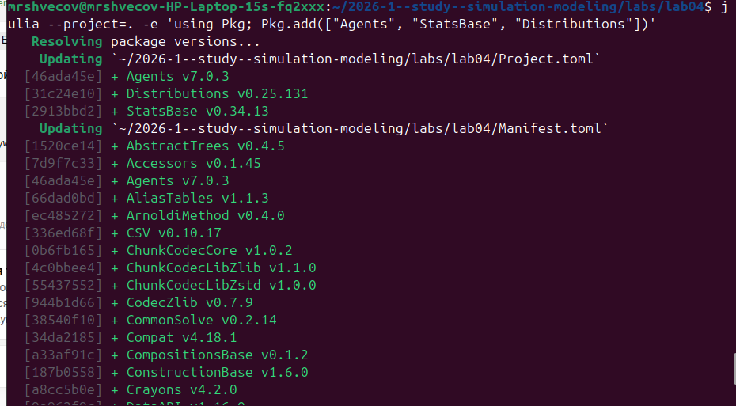
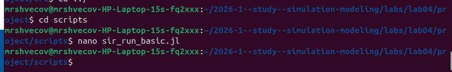
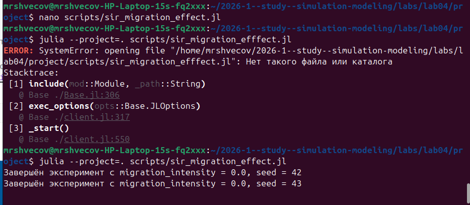
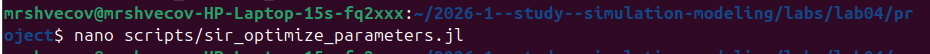
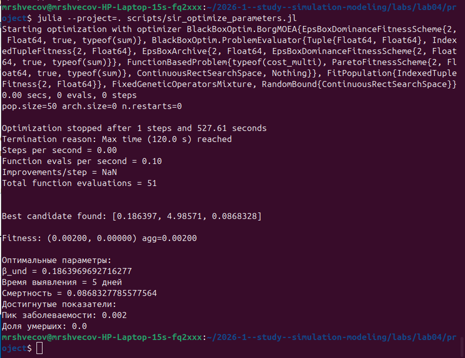
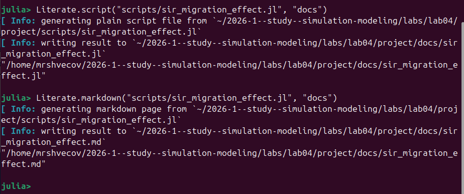
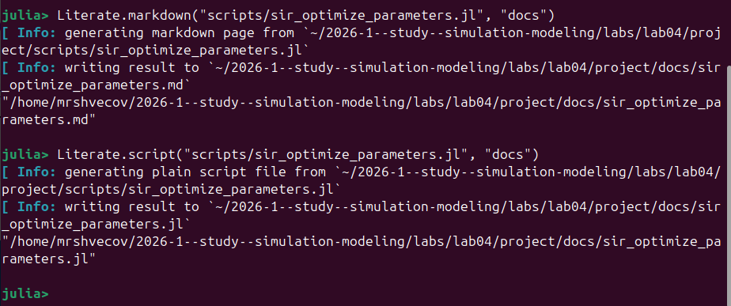

---
## Author
author:
  name: Швецов Михаил Романович 
  degrees: DSc
  orcid: 0000-0002-0877-7063
  email: 1132236100@rudn.ru
  affiliation:
    - name: Российский университет дружбы народов
      country: Российская Федерация
      postal-code: 117198
      city: Москва
      address: ул. Миклухо-Маклая, д. 6
## Title
title: Презентация лабораторной работы
subtitle: Лабораторная работа №3
license: CC BY
date: today
date-format: "2026-09-02" # Example: 2025-09-06
---

# Информация

---

## Докладчик

::: {.columns}

::: {.column width="70%"}

- **Швецов Михаил Романович**
- студент кафедры теории вероятностей и кибербезопасности
- Российский университет дружбы народов им. П. Лумумбы
- [1132236100@rudn.ru](mailto:1132236100@rudn.ru)
- <https://DarkkLord.github.io/ru/>

:::

::: {.column width="30%"}

:::

:::

--- 

# Выполнение лабораторной работы

---

Создаём каталог лабораторной работы.  ([рис. @fig-001]).

{#fig-001 width=70%}

---

Устанавливаем все необходимые пакеты ([рис. @fig-002]).

{#fig-002 width=70%}

---

Далее в каталоге src создаём необходимый скрипт ([рис. @fig-003]).

{#fig-003 width=70%}

---

Далее создаём необходимый скрипт scripts/sir_run_basic.jl ([рис. @fig-004]).

{#fig-004 width=70%}

---

Выполнение scripts/sir_run_basic.jl ([рис. @fig-005]).

{#fig-005 width=70%}

---

Создание и выполнение скрипта scripts/sir_scan_beta.jl ([рис. @fig-006]).

{#fig-006 width=70%}

---

Создание и выполнение скрипта scripts/sir_migration_effect.jl ([рис. @fig-007]).

{#fig-007 width=70%}

---

Создание скрипта scripts/sir_optimize_parameters.jl ([рис. @fig-008]).

{#fig-008 width=70%}

---

Загрузим недостающий пакет ([рис. @fig-009]).

{#fig-009 width=70%}

---

Выполним скрипт scripts/sir_optimize_parameters.jl ([рис. @fig-0010]).

{#fig-0010 width=70%}

---

Создание литературного стиля для scripts/sir_scan_beta.jl ([рис. @fig-0011]).

{#fig-0011 width=70%}

---

Создадим литературный стиль для scripts/sir_migration_effect.jl ([рис. @fig-0012]).

{#fig-0012 width=70%}

---

Создадим литературный стиль для scripts/sir_optimize_parameters.jl  ([рис. @fig-0013]).

{#fig-0013 width=70%}

---

Создадим литературный стиль для scripts/sir_visualize_dynamics.jl ([рис. @fig-0014]).

{#fig-0014 width=70%}

---

# Выводы

--- 

В данной лабораторной работе мы попрактиковались в создании литературного стиля кода и реализировали модель в агентном подходе на примере Эпидемиологической модели SIR.

---
