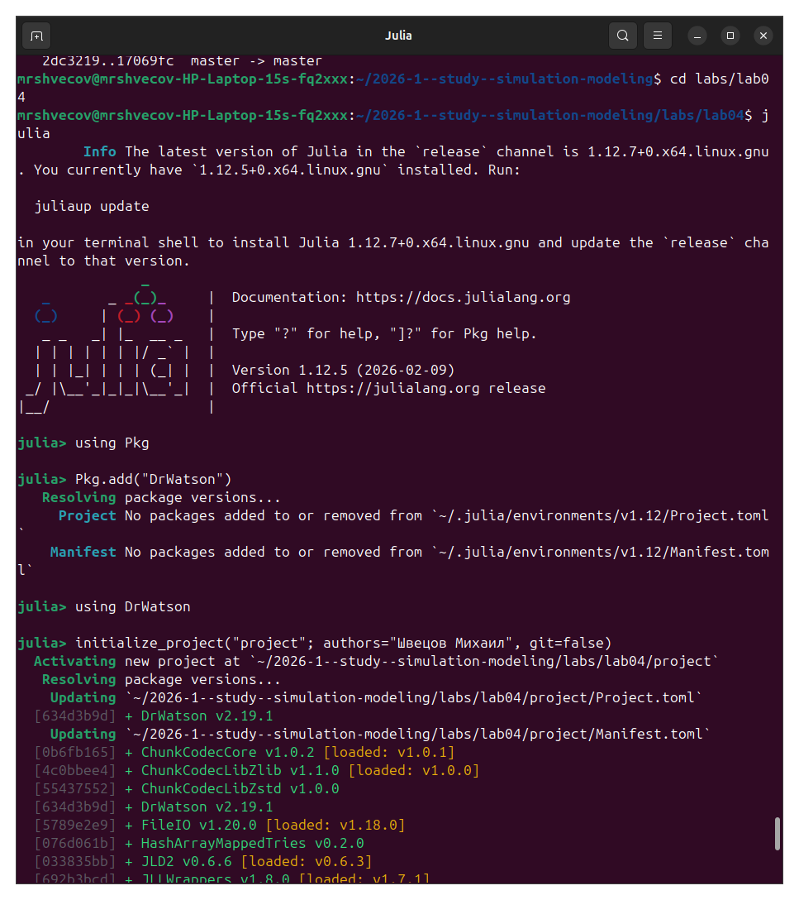
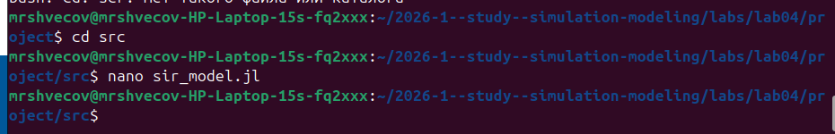
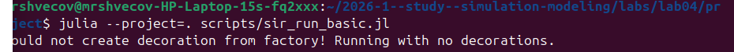
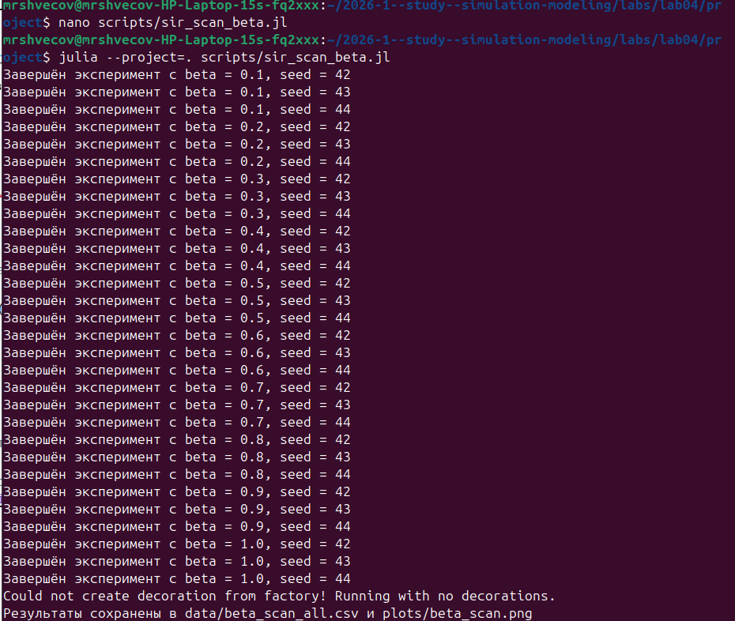
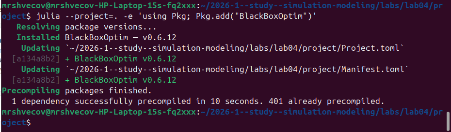
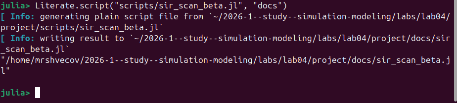
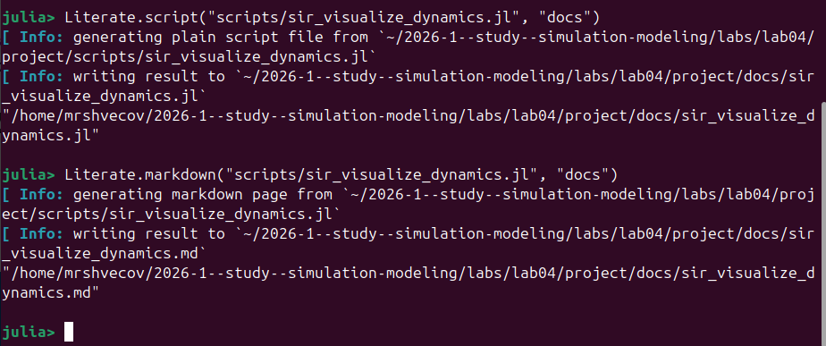

---
## Author
author:
  name: Швецов Михаил Романович
  degrees: DSc
  orcid: 0000-0002-0877-7063
  email: 1132236100@rudn.ru
  affiliation:
    - name: Российский университет дружбы народов
      country: Российская Федерация
      postal-code: 117198
      city: Москва
      address: ул. Миклухо-Маклая, д. 6

## Title
title: "Отчёт по лабораторной работе"
subtitle: "Лабораторная работа №4"
license: "CC BY"
---

# Цель работы

Целью работы является реализация основных моделей в агентном подходе на примере Эпидемиологической модели SIR.

# Задание

Выполнить работу и получить навыки создания литературного стиля реализировать модель в агентном подходе на примере Эпидемиологической модели SIR.

# Теоретическое введение

Классическая модель SIR

Модель SIR, предложенная Кермаком и Маккендриком в 1927 году, описывает динамику эпидемии в популяции, разделённой на три группы:

    (Susceptible) — восприимчивые к заболеванию индивиды;
    (Infectious) — инфицированные, способные заражать восприимчивых;
    (Recovered) — выздоровевшие (или умершие), получившие иммунитет и более не участвующие в распространении.

Классическая модель описывается системой обыкновенных дифференциальных уравнений:
где — коэффициент передачи инфекции, — скорость выздоровления.
Ограничения классического подхода

Несмотря на широкое применение, модель на ОДУ имеет ряд ограничений:

    Однородность популяции — все индивиды считаются одинаковыми.
    Отсутствие пространственной структуры — предполагается полное перемешивание.
    Детерминированность — не учитываются случайные флуктуации.
    Непрерывность — количество людей рассматривается как непрерывная величина.

Преимущества агентного подхода

Агентное моделирование позволяет преодолеть эти ограничения:

    Каждый индивид моделируется отдельно с уникальными характеристиками.
    Взаимодействия происходят локально в пространстве или социальной сети.
    Процессы носят стохастический характер.
    Можно учитывать гетерогенность контактов, мобильность, меры контроля.

# Выполнение лабораторной работы

Создаём каталог лабораторной работы.  ([рис. @fig-001]).

{#fig-001 width=70%}

Устанавливаем все необходимые пакеты ([рис. @fig-002]).

{#fig-002 width=70%}

Далее в каталоге src создаём необходимый скрипт ([рис. @fig-003]).

{#fig-003 width=70%}

Далее создаём необходимый скрипт scripts/sir_run_basic.jl ([рис. @fig-004]).

{#fig-004 width=70%}

Выполнение scripts/sir_run_basic.jl ([рис. @fig-005]).

{#fig-005 width=70%}

Создание и выполнение скрипта scripts/sir_scan_beta.jl ([рис. @fig-006]).

{#fig-006 width=70%}

Создание и выполнение скрипта scripts/sir_migration_effect.jl ([рис. @fig-007]).

{#fig-007 width=70%}

Создание скрипта scripts/sir_optimize_parameters.jl ([рис. @fig-008]).

{#fig-008 width=70%}

Загрузим недостающий пакет ([рис. @fig-009]).

{#fig-009 width=70%}

Выполним скрипт scripts/sir_optimize_parameters.jl ([рис. @fig-0010]).

{#fig-0010 width=70%}

Создание литературного стиля для scripts/sir_scan_beta.jl ([рис. @fig-0011]).

{#fig-0011 width=70%}

Создадим литературный стиль для scripts/sir_migration_effect.jl ([рис. @fig-0012]).

{#fig-0012 width=70%}

Создадим литературный стиль для scripts/sir_optimize_parameters.jl  ([рис. @fig-0013]).

{#fig-0013 width=70%}

Создадим литературный стиль для scripts/sir_visualize_dynamics.jl ([рис. @fig-0014]).

{#fig-0014 width=70%}











# Выводы

В данной лабораторной работе мы попрактиковались в создании литературного стиля кода и реализировали модель в агентном подходе на примере Эпидемиологической модели SIR.

# Список литературы{.unnumbered}

::: {#refs}
:::
