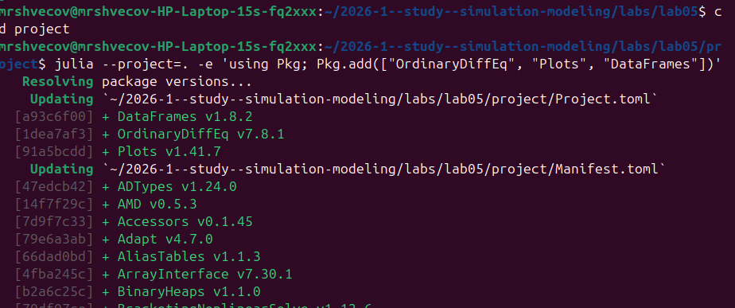
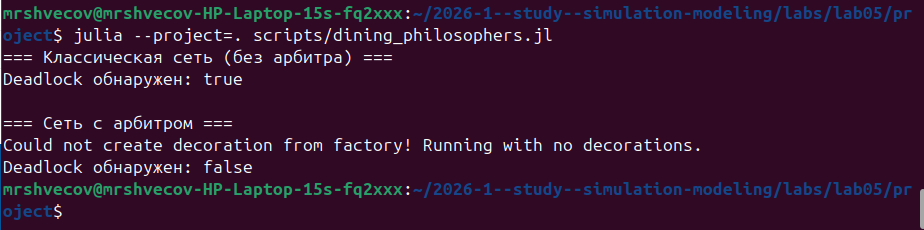
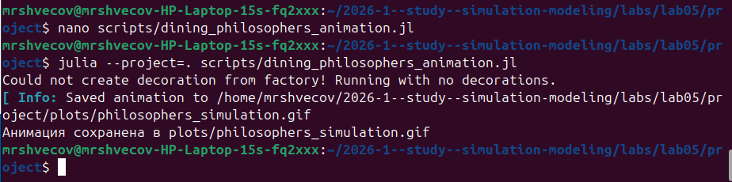
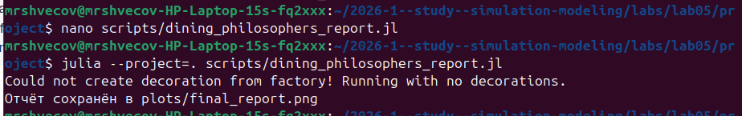
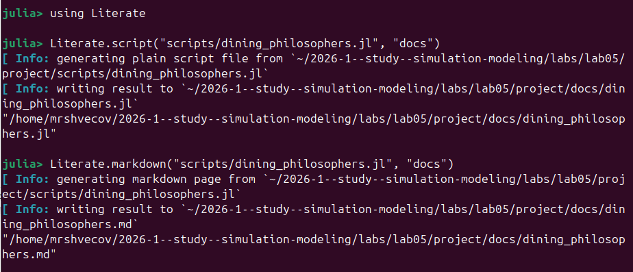
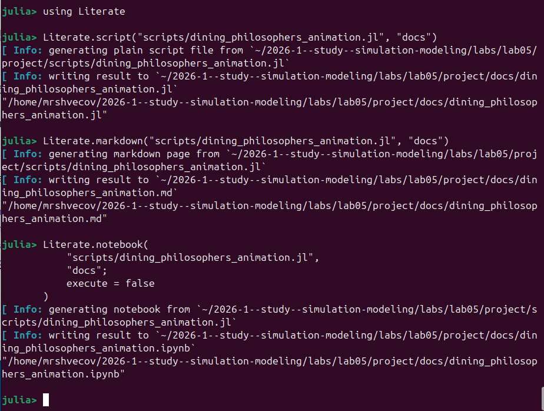
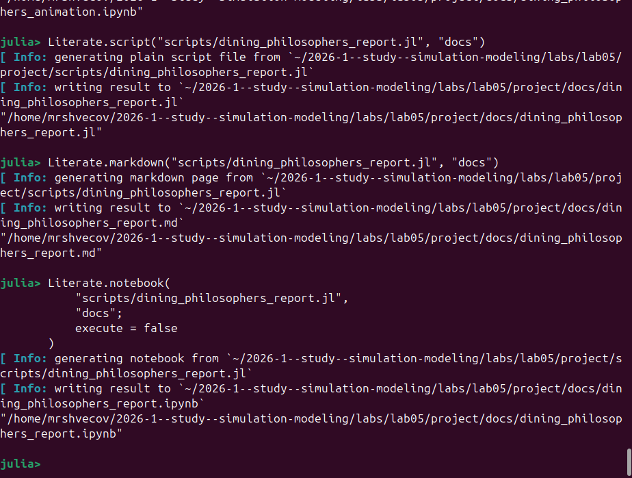

---
## Author
author:
  name: Швецов Михаил Романович
  degrees: DSc
  orcid: 0000-0002-0877-7063
  email: 1132236100@rudn.ru
  affiliation:
    - name: Российский университет дружбы народов
      country: Российская Федерация
      postal-code: 117198
      city: Москва
      address: ул. Миклухо-Маклая, д. 6

## Title
title: "Отчёт по лабораторной работе"
subtitle: "Лабораторная работа №5"
license: "CC BY"
---

# Цель работы

    Построить сеть Петри для пяти философов, моделируя захват и освобождение вилок.
    Обнаружить состояние взаимной блокировки (deadlock), когда каждый философ взял одну вилку и ждёт вторую.
    Провести имитационное моделирование (стохастическое и детерминированное) и выявить наличие deadlock.
    Модифицировать сеть, чтобы предотвратить deadlock.
    Проанализировать результаты и оформить отчёт с графиками и анимацией.

# Задание

Выполнить работу и получить навыки создания литературного стиля реализировать модель в агентном подходе на примере Эпидемиологической модели SIR.

# Теоретическое введение

Сеть Петри есть математический аппарат для моделирования дискретных систем. Графически она представляется как двудольный ориентированный граф двух типов вершин: позиции (круги) и переходы (прямоугольники).

    Позиции (Places) суть пассивные элементы, описывающие состояние системы (например, наличие ресурса или выполнение условия).
        Внутри позиции могут находиться фишки (tokens) — неотрицательное целое число, указывающее на количество ресурсов.
    Переходы (Transitions) суть активные элементы, описывающие события или действия системы.
        Они могут срабатывать, изменяя состояние модели.
    Дуги (Arcs) суть направленные соединения между позициями и переходами (но не между двумя позициями или двумя переходами), которые показывают, как состояние влияет на события и наоборот.
    Маркировка (Marking) есть распределение фишек по позициям в определённый момент времени, то есть текущее состояние модели.
        Смена маркировок происходит при срабатывании переходов в соответствии с определёнными правилами.

Теория сетей Петри, появившаяся как инструмент для анализа химических процессов, сегодня является мощным и наглядным математическим аппаратом. Она незаменима везде, где нужно описать параллельные, асинхронные и распределённые системы. В её основе лежат всего четыре элемента, а богатство поведения возникает из их комбинации.

# Выполнение лабораторной работы

Создаём каталог лабораторной работы и устанавливаем необходимые пакеты ([рис. @fig-001]).

{#fig-001 width=70%}

Создаём код модели в каталоге /src ([рис. @fig-002]).

{#fig-002 width=70%}

Создаём первый скрипт scripts/dining_philosophers.jl и догружаем недостающий пакет CSV [рис. @fig-003]).

{#fig-003 width=70%}

Выполняем скрипт scripts/dining_philosophers.jl ([рис. @fig-004]).

{#fig-004 width=70%}

Создание и выполнение скрипта scripts/dining_philosophers_animation.jl ([рис. @fig-005]).

{#fig-005 width=70%}

Создание и выполнение скрипта scripts/dining_philosophers_report.jl ([рис. @fig-006]).

{#fig-006 width=70%}

Создание документа jupiter-notebook для файла dining_philosophers.jl ([рис. @fig-007]).

{#fig-007 width=70%}

Создание чистого кода и документа markdown для dining_philosophers.jl ([рис. @fig-008]).

{#fig-008 width=70%}

Создание чистого кода, документа markdown и документа jupiter-notebook для dining_philosophers_animation.jl ([рис. @fig-009]).

{#fig-009 width=70%}

Создание чистого кода, документа markdown и документа jupiter-notebook для dining_philosophers_report.jl ([рис. @fig-0010]).

{#fig-0010 width=70%}

# Код







# Выводы

В данной лабораторной работе мы построили сеть Петри для пяти философов, моделируя захват и освобождение вилок.
    Обнаружили состояние взаимной блокировки (deadlock), когда каждый философ взял одну вилку и ждёт вторую.
    Провесли имитационное моделирование (стохастическое и детерминированное) и выявили наличие deadlock.
    Модифицировали сеть, чтобы предотвратить deadlock.
    Проанализировали результаты и оформить отчёт с графиками и анимацией.

# Список литературы{.unnumbered}

::: {#refs}
:::