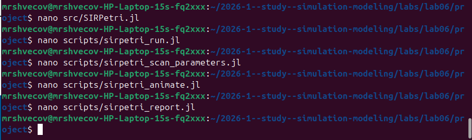
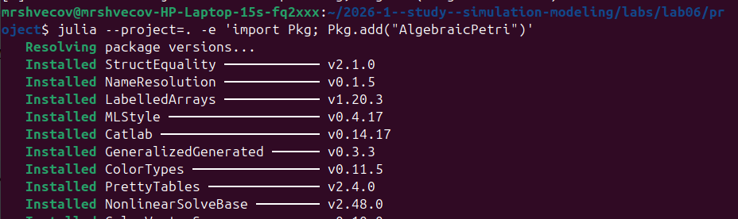
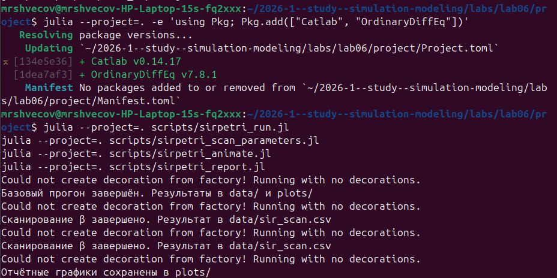
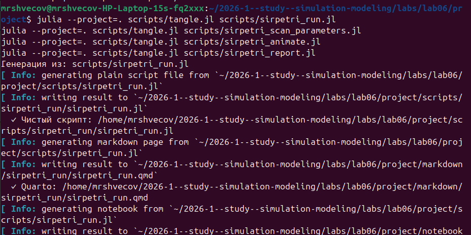
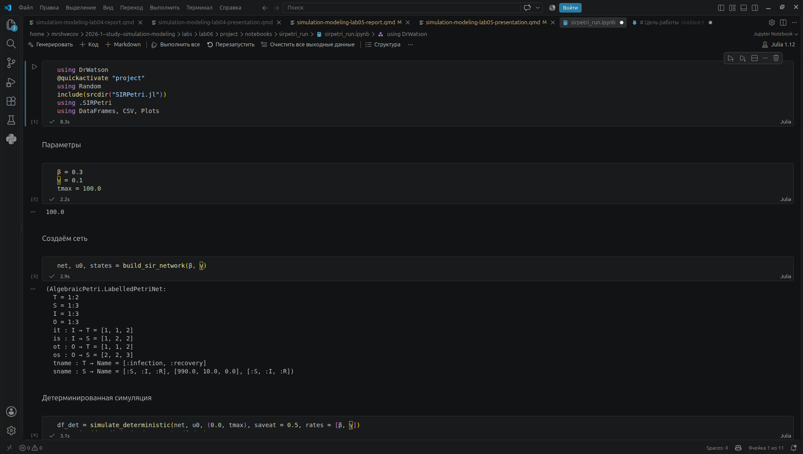
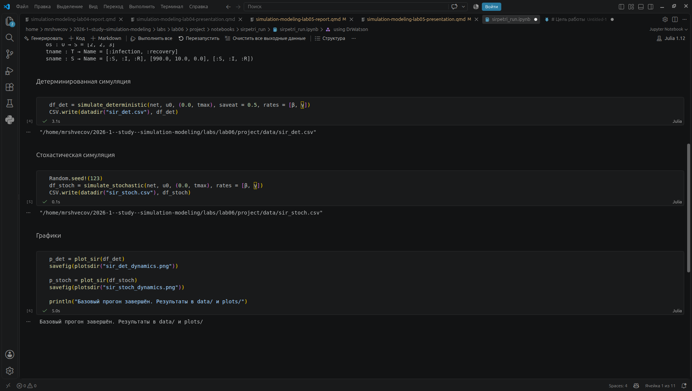
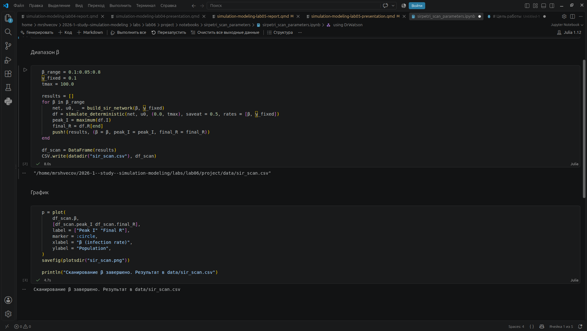
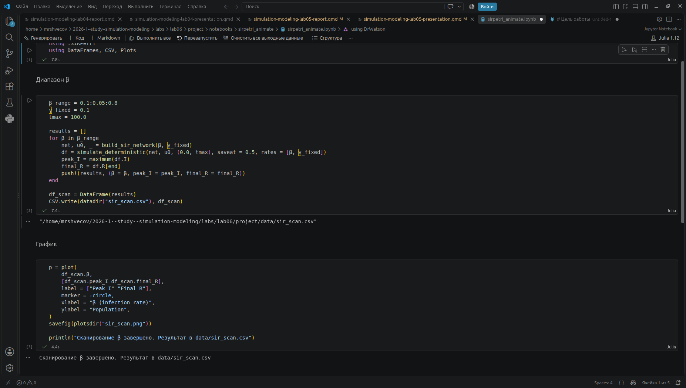
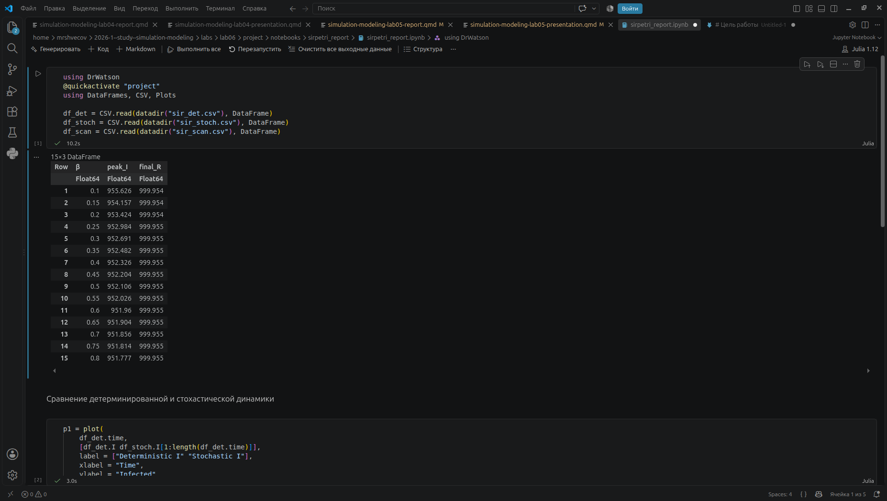
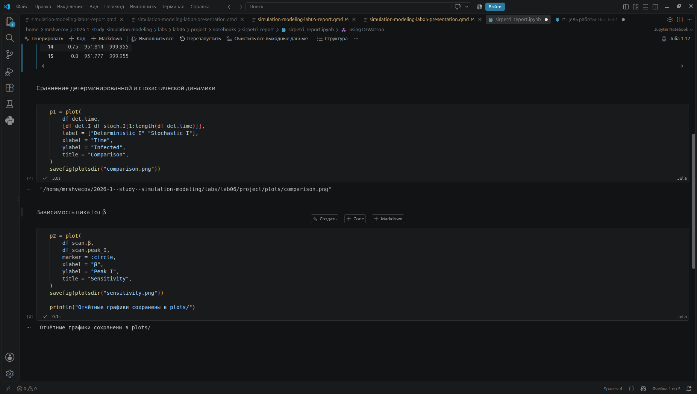

---
author:
  name: Швецов Михаил Романович
  degrees: student
  orcid: 0000-0002-0877-7063
  email: 1132236100@rudn.ru
  affiliation:
    - name: Российский университет дружбы народов
      country: Российская Федерация
      postal-code: 117198
      city: Москва
      address: ул. Миклухо-Маклая, д. 6

title: "Отчёт по лабораторной работе"
subtitle: "Лабораторная работа №6"
license: "CC BY"

execute:
  enabled: false
---

# Цель работы

Цель данной лаборатоной работы: Реализация основных моделей в подходе сетей Петри.

# Задание

Основной задачей является реализовать модель эпидемии SIR (Susceptible–Infectious–Recovered) с использованием сетей Петри. 

# Теоретическое введение

Описание модели

Реализована модель эпидемии SIR (Susceptible–Infectious–Recovered) с использованием сетей Петри. Модель описывает переходы между тремя состояниями:

    (восприимчивые) — могут заразиться;
    (инфицированные) — заражают других и выздоравливают;
    (выздоровевшие / с иммунитетом) — больше не участвуют в эпидемии.

Сеть Петри содержит два перехода:

    infection: (скорость β);
    recovery: (скорость γ).

# Выполнение лабораторной работы

Ранее я создал рабочее пространство лабораторной работы по аналогии с лабораторной работой №1, также были установлены базовые пакеты. Далее будем записывать в отчёт пошагово выполнение конкретно этой лабораторной работы. 

Создаём скрипт модели в каталоге /src, далее в каталоге /scripts по очереди создаём скрипты для работы ([рис. @fig-001]).

{#fig-001 width=70%}

Загрузка одного из недостающих пакетов, которые будут использоваты в данной лаборатоной работе ([рис. @fig-002]).

{#fig-002 width=70%}

Также загружаем недостающий пакет Catlab, далее запускаем каждый скрипт, который используется в лабораторной работе [рис. @fig-003]).

{#fig-003 width=70%}

С помощью скрипта из первой лаборатоной работы tangle.jl мы создаём все необходимые форматы ([рис. @fig-004]).

{#fig-004 width=70%}

Выполняем скрипт sirpetri_run.jl в jupiter-notebook ([рис. @fig-005]) ([рис. @fig-006]).

{#fig-005 width=70%}

{#fig-006 width=70%}

Выполняем скрипт sirpetri_scan_parameters.jl в jupiter-notebook ([рис. @fig-007]).

{#fig-007 width=70%}

Выполняем скрипт sirpetri_animate.jl в jupiter-notebook ([рис. @fig-008]).

{#fig-008 width=70%}

Выполняем скрипт sirpetri_report.jl в jupiter-notebook ([рис. @fig-009]) ([рис. @fig-0010]).

{#fig-009 width=70%}

{#fig-0010 width=70%}

<!--





-->

# Выводы

В данной лаборатоной работе мы реализовали модель эпидемии SIR (Susceptible–Infectious–Recovered) с использованием сетей Петри.

# Список литературы{.unnumbered}

::: {#refs}
:::
