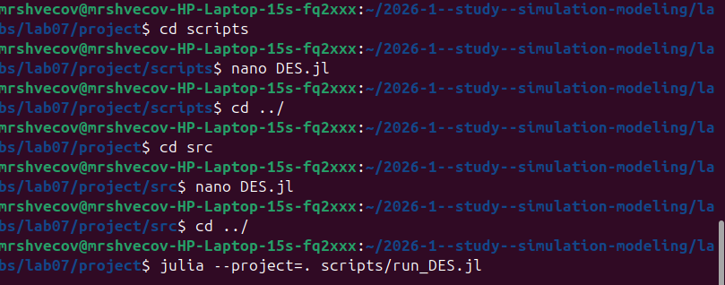
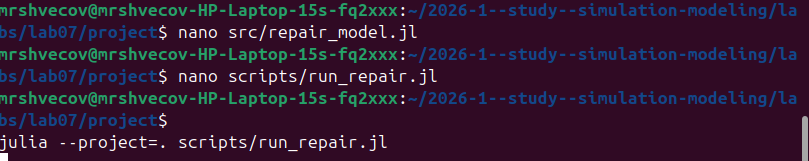
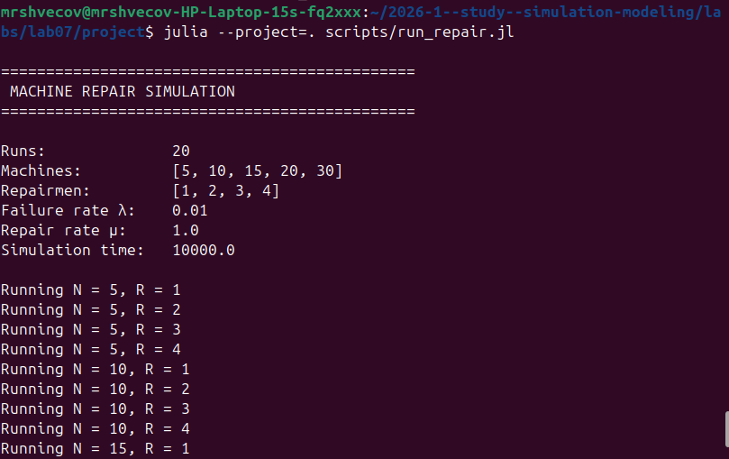
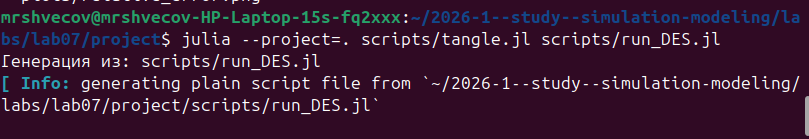
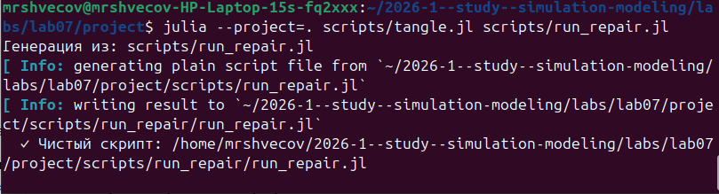

---
## Author
author:
  name: Швецов Михаил Романович 
  degrees: DSc
  orcid: 0000-0002-0877-7063
  email: 1132236100@rudn.ru
  affiliation:
    - name: Российский университет дружбы народов
      country: Российская Федерация
      postal-code: 117198
      city: Москва
      address: ул. Миклухо-Маклая, д. 6
## Title
title: Презентация лабораторной работы
subtitle: Лабораторная работа №7
license: CC BY
date: today
date-format: "2026-09-02" # Example: 2025-09-06
---

# Информация

---

## Докладчик

::: {.columns}

::: {.column width="70%"}

- **Швецов Михаил Романович**
- студент кафедры теории вероятностей и кибербезопасности
- Российский университет дружбы народов им. П. Лумумбы
- [1132236100@rudn.ru](mailto:1132236100@rudn.ru)
- <https://DarkkLord.github.io/ru/>

:::

::: {.column width="30%"}

:::

:::

--- 

# Выполнение лабораторной работы

Ранее я создал рабочее пространство лабораторной работы по аналогии с лабораторной работой №1, также были установлены базовые пакеты. Далее будем записывать в отчёт пошагово выполнение конкретно этой лабораторной работы. 

Создаём скрипт модели в каталоге /src, далее в каталоге /scripts по очереди создаём скрипты для работы c дискретно-событийным симулятором и выполняем его [рис. @fig-001]).

{#fig-001 width=70%}

---

Создаём скрипт модели в каталоге /src, далее в каталоге /scripts по очереди создаём скрипты для работы c моделью Росса  ([рис. @fig-002]).

{#fig-002 width=70%}

---

Выполняем скрипт для реализации модели Росса ([рис. @fig-003]).

{#fig-003 width=70%}

---

С помощью скрипта из первой лаборатоной работы tangle.jl мы создаём все необходимые форматы для дискретно-событийного симулятора ([рис. @fig-004]).

{#fig-004 width=70%}

---

С помощью скрипта из первой лаборатоной работы tangle.jl мы создаём все необходимые форматы для моделли Росса ([рис. @fig-005]).

{#fig-005 width=70%}

---

# Выводы

В данной лаборатоной работе мы изучить алгоритм работы дискретно-событийного симулятора и модели Росса и реализовали их.

